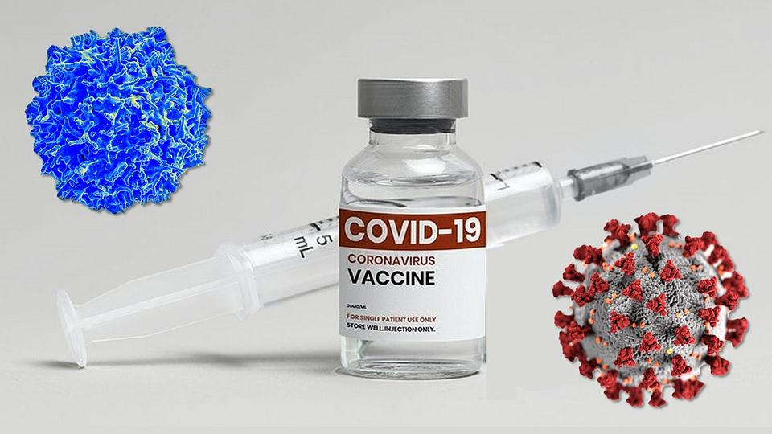

## Portfolio

### Project 1: ETL Process & Dashboard on Olist Ecommerce Data 
<iframe title="dashboard_gold_olist" 
        width="600" 
        height="373.5" 
        src="https://app.powerbi.com/view?r=eyJrIjoiMjlkMDE2NDEtYzExOC00OWViLTg3NWMtZjlhZDM2N2JmMGRmIiwidCI6IjlkOTc1MzBlLThmMjctNDEzNy1hMmE5LTVjYjRkY2YyNmYyZSIsImMiOjh9" 
        frameborder="0" 
        allowFullScreen="true"></iframe>
  

This is my end-to-end data engineering project built using two main tools: Databricks for data processing and Power BI for visualization. The data used here is Kaggle Olist Ecommerce Data. The original dataset contains multiple tables, with the three largest- order_payments, orders, and order_items- each containing approximately 100,000 rows.

Using Databricks, the raw data is first ingested and stored in the bronze_olist schema. The tables are then cleaned, transformed, and loaded into the silver_olist schema, followed by aggregation into the gold_olist schema. All gold_olist tables are exported to CSV files, compressed into a zip archive, and then loaded into Power BI for dashboard building to visualize key business metrics.

- <a href="/Databricks_transformation-csv/1_Ingest_data_to_Bronze_Olist.html" target="_blank">Notebook 1: Ingest data to Bronze Olist</a> 
- <a href="/Databricks_transformation-csv/2_Transform_Data_to_silver_layer.html" target="_blank">Notebook 2: Transform Data to silver layer</a> 
- <a href="/Databricks_transformation-csv/3_Aggregate_data_&_load_to_gold_layer.html" target="_blank">Notebook 3: Aggregate data & load to gold layer</a> 
- <a href="/Databricks_transformation-csv/4_Download_csv_files_from_gold_layer.html" target="_blank">Notebook 4: Download csv files from gold layer</a> 
- <a href="/Databricks_transformation-csv/ERD.png" target="_blank">ERD</a> 

---

### Project 2: Default Prediction from Lending Club Data
This project is a part of the course Data Science for Business 1 at Aalto University.The dataset was the loan data of Lending CLub downloaded from Kaggle, containing data that has already been cleaned. The goal of the project was to build different predictive models so as to predict whether a customer is likely to pay back the loan or not. Because the data was imbalanced, SMOTE method was applied to balance the data. However, the models are built from both original and balanced data.

3 models were built: 2 Logistics Regression models( one with balanced and imbalanced data) and Decision Tree with balanced data. The precision, recall, accuracy and AUC scores, and expected benefits of 3 models are calculated. In summary, Logistic Regression with balanced data is chosen for prediction because it has highest expected benefit, highest AUC score and highest accuracy score. 

- [Python Notebook](/DefaultPrediction/Defaul_prediction.html) 
- [Presentation](/DefaultPrediction/Default_prediction.pdf) 

---

### Project 3: Vaccine data: ETL process and exploration
This project is a part of the course Databases for Data Science at Aalto University. In this project, ETL process is built.The data from excel sheets are extracted, tranformed, and loaded to the database. Later, the data exploration work is conducted. 

- [UML Diagram](/DefaultPrediction/Default_prediction.pdf)  
- [Python Notebook](/Vaccine_git/vaccine_python.html) 

---

### Project 4: Accident Analysis
This project is a part of the course Capstone: Business Intelligence at Aalto University. In this project, many insights are extracted and recommendations are made on accident data provided. The tool used is Tableau.

- [Video of Insights and Recommendations](https://aalto.cloud.panopto.eu/Panopto/Pages/Viewer.aspx?id=40eb5f77-5995-425a-bf87-afe70139ca00) 

---

### Project 5: Survival Analysis- Predict survival rate for e-scooters. 
This project is a module of the course Data Science for Business 2 at Aalto University. The dataset includes 283 observations of 283 scooters with 7 attributes.
A survival analysis with Kaplan Meier Estimator is conducted with the historical data to build a survival analysis model to predict the survival rate of the scooters. Moreover, a survival analysis with Kaplan Meier Estimator for scooters of manufacturers A,B, and C are also conducted.

Log-rank test is conducted to confirm the difference among the survival rates of scootters from manufacturers A, B, and C. 2 models(Cox Regression and Random Survival Forest) are built  to predict the survival rate of the scooters. Later, those models are used to predict the survival rate of 10 new scooters which were not included in the original dataset.
- [Python Notebook](Scooter Survival Analysis/survival_analysis.html) 
- [Report](Scooter Survival Analysis/Survival_analysis_report.pdf) 

---

Page template forked from <a href="https://github.com/evanca/quick-portfolio">evanca</a>

<!-- Remove above link if you don't want to attibute -->
